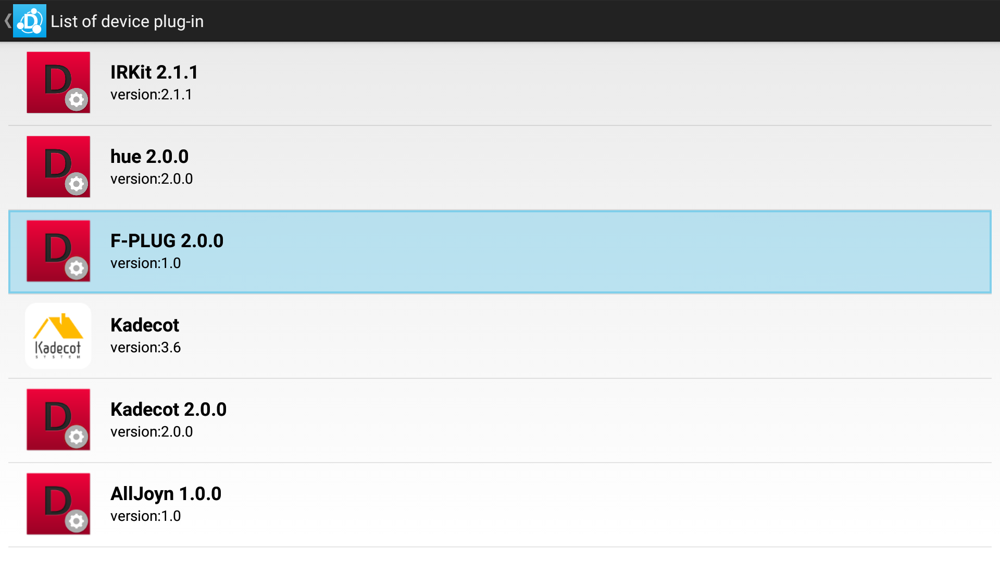
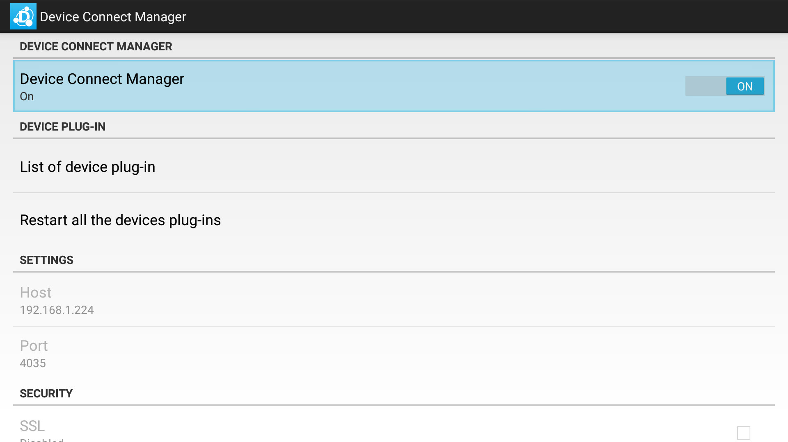
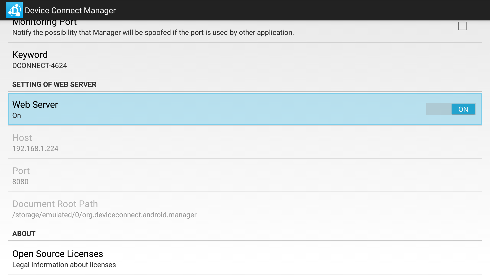
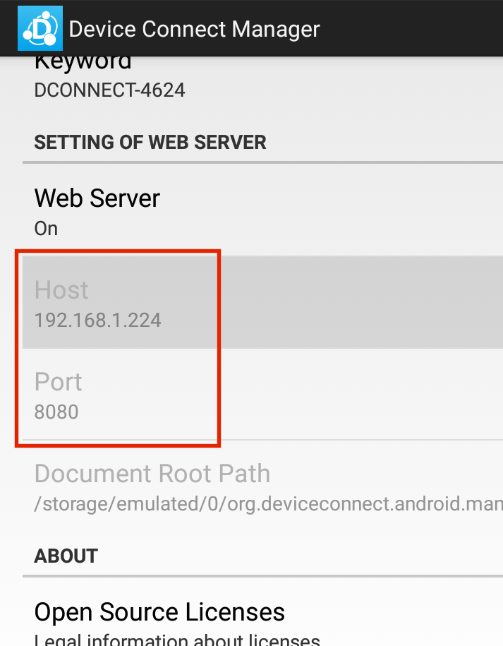
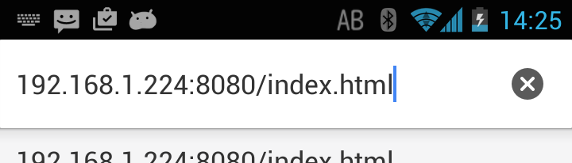
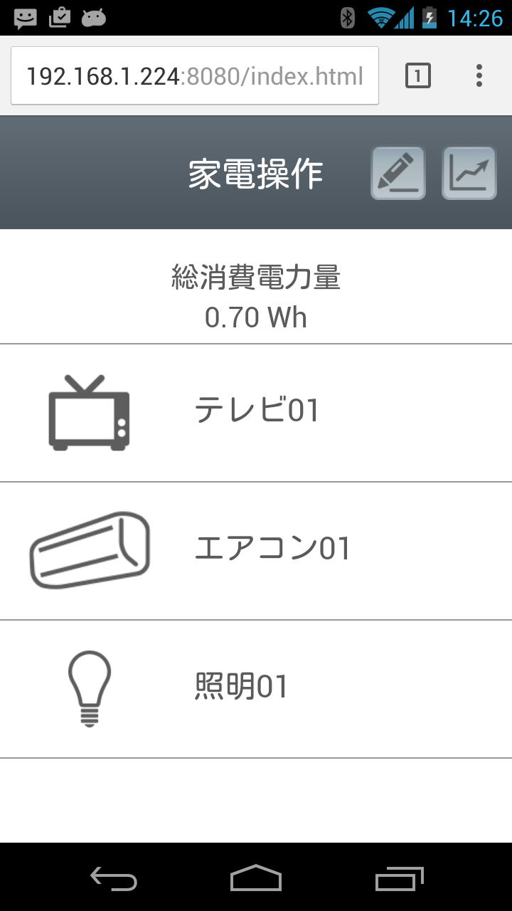

# Home Electronics Demo


# Introduction
This demo application shows operating a home electronics using "Device Connect". Power Meter that connected to each device will show electric power consumption. So you can confirm effects of reduction by your operations. This project is developed for home cooperation demonstration.
For running, you need to install particular kadecot application to smart device.


# Requirements
* Android Device

For install APKs.

* F-PLUG

Using as Power Meter.

* Kadecot

For ECHONET Lite-adaptive Devices control.

* ECHONET Lite-adaptive Devices

For air conditioner and Light.

* Hue Bridge and Hue-adaptive Devices

For Light control.

* IR-Kit and IR-Kit-adaptive Devices

For TV or Light control.

* AllJoyn-adaptive Devices

For Light control.

# How To Use

## install APKs

Using ADB, install follow APK files in ```APK``` directory.

* dConnectManager.apk
* dConnectDeviceFPLUG.apk
* dConnectDeviceHue.apk
* dConnectDeviceIRKit.apk
* dConnectDeviceKadecot.apk
* dConnectDeviceAllJoyn.apk

```adb install -r dConnectManager.apk```

If you using dConnectDeviceKadecot, you need install kadecot in ```APK``` directory.

* kadecot.apk

If you using NexusPlayer as Android Device, you need install bellow in ```APK``` directory.
* BluetoothSPPSettings.apk

This is requirements for pairing F-PLUG on NexusPlayer.

## setting each devices

You need settings about F-PLUG pairing, IRKit registration, Hue discovering and so on. Most devices need connecting local network same as Android Device.

How to setting each devices, Please check setting view in each device plug-in.

<center></center>

## install demoSite files
The demoSite files install into Android Device using ADB. This app is accessed from other device in local network or self.

```adb push demoSite/ /sdcard/org.deviceconnect.android.manager```

## launch and access

Launch Device Connect Manager and setting bellow.

* Allow External IP > check
* Local OAuth > uncheck

Next, turn on Device Connect Manager and Web Server.

<center></center>

Device Connect Launched! You need check IP address for access to the app.

<center></center>

Enter URL to Any Device's Browser(Include ```index.html```.)

<center></center>

The app available.

<center></center>

# Lisence
This project is licensed under MIT license. See LICENSE.TXT for details.
