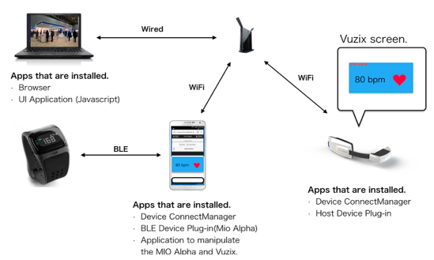
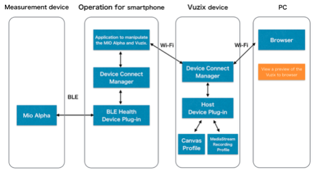

# Device Connect Vuzix M100 demo UI application in MWC2015

# １．Introduction

　This document, Vuzix M100 method of introducing the demo UI application using the Device Connect API, and will explain how to operate.

# ２．For M100 demo environment

　I will show the current M100 demo requirements below.
　

１. Get from Heart Rate data smartphone and BLE connected Mio Alpha.
2. The obtained Heart Rate data and displays it in the Vuzix M100 on the screen.
3. The camera captured images of Vuzix M100 at the same time, I will display at PC.

　As M100 demo environment, we have assumed the following configuration.

* Used equipment
 * Vuzix M100（OS2.2）
 * Mio Alpha
 * Android smartphone (OS 4.3 or higher)
 * PC (Windows7 or more, or, MAC OS X)
 * Wireless LAN router (using the ASUS RT-AC87U In operation test)
 

　Shows the demo configuration diagram below.

Figure 1 demo configuration diagram

Figure 2 Device Connect plug-in cooperation Figure

