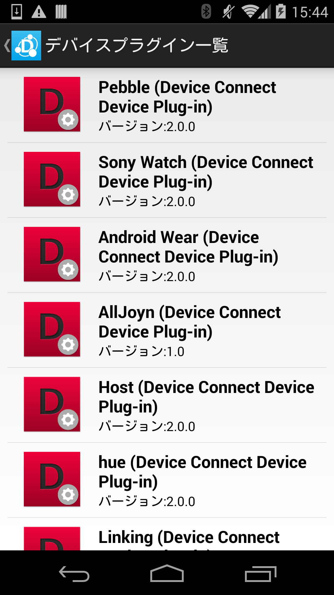
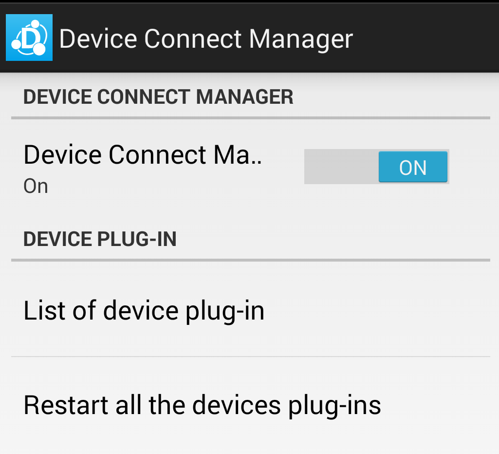
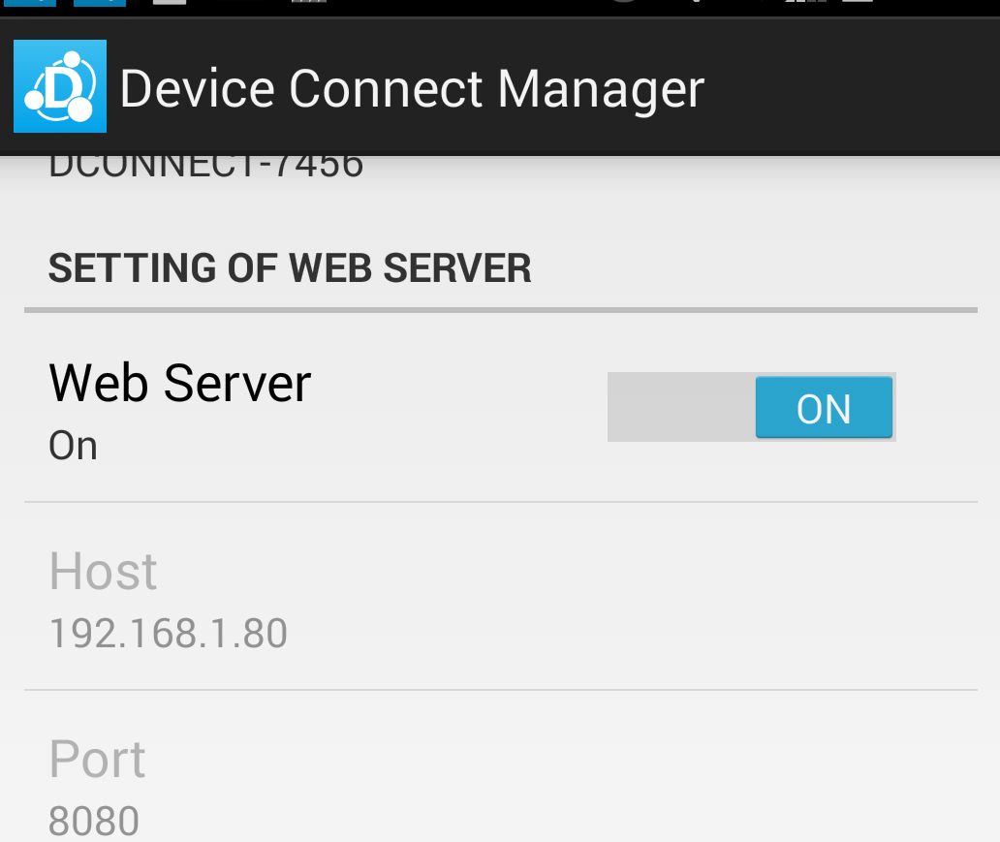
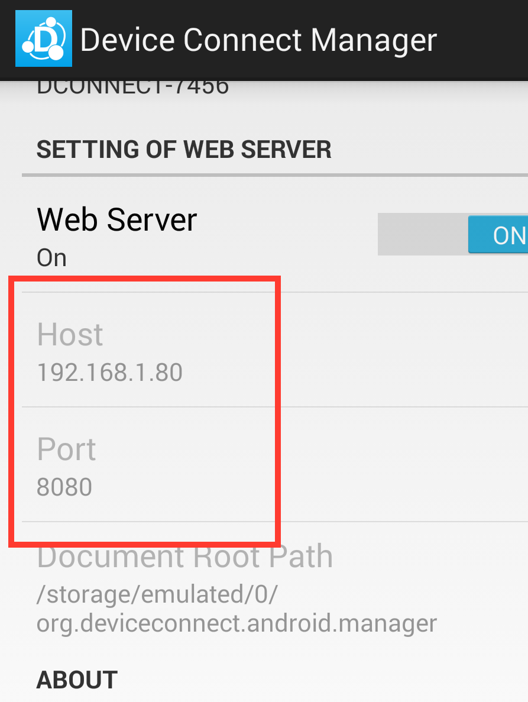
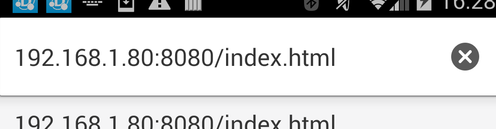
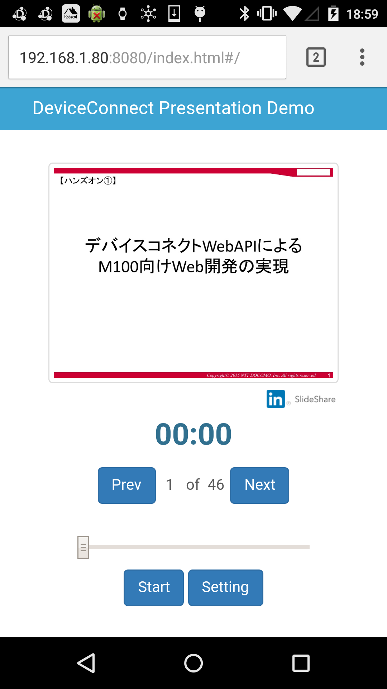

# Presentation Demo


# Introduction
This demo application shows presentation using "Device Connect". The app can provide presentation with various devices. Slide resources is taken from slideshare. The slides display on device conforming to the canvas profile api, like a Chromecast. Other feature is, timer function. This app can set the any timers for presentation. For instance, flashing light, vibration and light off.

# Requirements
* Android Device

For install APKs.

* Chromecast/Pebble/SonySW/AndroidWear/Host adaptive Devices

Using as display target.

* Linking/Hue/Alljoyn/Sphero adaptive Devices

Using as timer target. (light)

* Host

Using as timer target. (vibration)

# How To Use

## install APKs

Using ADB, install follow APK files in ```APK``` directory.

* dConnectManager.apk
* dConnectDeviceLinking.apk
* dConnectDeviceAlljoyn.apk
* dConnectDeviceChromecast.apk
* dConnectDeviceHost.apk
* dConnectDeviceHue.apk
* dConnectDevicePebble.apk
* dConnectDeviceSonySW.apk
* dConnectDeviceSphero.apk
* dConnectDeviceWear.apk

```adb install -r dConnectManager.apk```

This Demo Application can run standalone. But if you install above APKs, The App can use great display and timer function.

If you using dConnectDeviceLinking, you need install Linking.

* https://linkingiot.com/

## setting each devices

You need settings about linking connecting, Chromecast discovering and so on. Most devices need connecting local network same as Android Device.

How to setting each devices, Please check setting view in each device plug-in.

<center></center>

## install demoSite files
The demoSite files install into Android Device using ADB. This app is accessed from other device in local network or self.

```adb push demoSite/ /sdcard/org.deviceconnect.android.manager```

## launch and access

Launch Device Connect Manager and setting bellow.

* Allow External IP > check
* Local OAuth > uncheck

Next, turn on Device Connect Manager and Web Server.

<center></center>

Device Connect Launched! You need check IP address for access to the app.

<center></center>

Enter URL to Any Device's Browser(Include ```index.html```.)

<center></center>

The app available.

<center></center>

For more detail, let's go to Setting.

# Lisence
This project is licensed under MIT license. See LICENSE.TXT for details.
