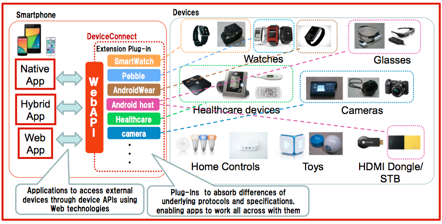

# DeviceConnect-Experiments
DeviceConnect Experiments.

# DeviceConnect WebAPI -OMA GotAPI implementation-

DeviceConnect WebAPI achieves interoperability for various OS and protocols.

 
 
* NTT DOCOMO open sourced GotAPI project as “Device Connect”
	* [https://github.com/DeviceConnect/](https://github.com/DeviceConnect/)
* It will soon be updated to be compliant with GotAPI 1.0
