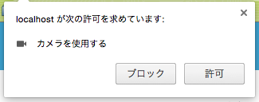
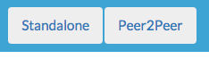
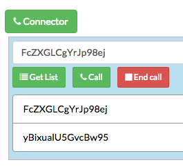
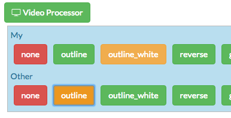
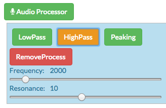

# WebRTC Process Demo


# Introduction
This demo application shows processes of video and audio on WebRTC.
Canvas API used for processing video, And Web Audio API used for processing audio. Processed audio can be send to peer. But processed video can not be send.

# Requirements
* skyway-id

This demo application's WebRTC connection is using [skyway](http://nttcom.github.io/skyway/). So you need skyway account and skyway-id.

If you get your skywayId, Modify ``demoSite/js/Demo.js``.

```
var skywayId = 'your-skyway-id';
```

* server

WebRTC is using domain base connection. So you need host this demo onto somewhere server. And you need setting your domain in skyway.

If you using Mac, you can try simple way below.

1. Clone this repository
* Open console
* ```cd demoSite```
* ```python -m SimpleHTTPServer 8000```
* Test with your browser the URL "http://localhost:8000"

And you need setting domain ``localhost`` in skyway.

# How To Use
## Access and Request media

When you access this application, browser requests camera and mic to you. You should allow this requests for using this application.

<center></center>

## Switching mode

* peer2peer

This mode can use WebRTC connections. And Processed audio send to peer.

* standalone

This mode can not use WebRTC connections. This mode can be used for checking processes.

<center></center>

## Connection by WebRTC

Click ``Connector``, and search peers by click ``Get List``. Next you select peer in the list. Lastly, you click ``Call``! If connection succeed, peer's video and audio will be available.

<center></center>

## Processing video

Click ``Video Processor``, and select pattern of process. When you select any process, you can see processed video in realtime.

<center></center>

## Processing audio

Click ``Audio Processor``, and select pattern of process. Each process has some parameter. You can control the parameters by available UI.

<center></center>

# Lisence
This project is licensed under MIT license. See LICENSE.TXT for details.
