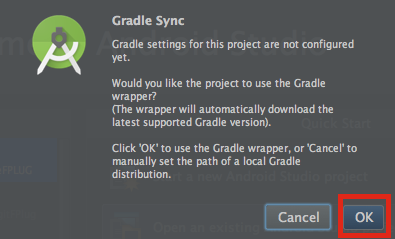

# AWSIot プラグイン

このAWSIotプラグインでは、AWSIotサーバを経由して、遠隔地にあるDevice Connect Managerを操作するための機能を提供します。

このプラグインを使用するために、AWSIotにアカウントが必要になります。

## 目次
* [開発環境](#section1)
* [サポートするプロファイル](#section2)
* [ビルド手順](#section3)
  * [Android AWS IoT デバイスプラグインのBuildに必要なパッケージ](#section3.1)<br>
     * [Device Connect SDK](#section3.1.1)
  * [プロジェクトのビルド手順](#section3.2)
     * [Android Studio](#section3.2.1)
       * [dConnectDeviceAWSIotのImport](#section3.2.1.1)
       * [libbarchart-udt-core-android.so, libstlport_shared.soのBuild](#section3.2.1.2)
       * [dConnectDeviceAWSIotのBuild](#section3.2.1.3)


## <a name="section1">開発環境</a>
Android Studio 2.2.1以上

## <a name="section2">サポートするプロファイル</a>

* airConditioner
* atmosphericPressure
* battery
* camera
* canvas
* connection
* deviceOrientation
* driveController
* ecg
* echonetLite
* file
* fileDescriptor
* geolocation
* gpio
* health
* humanDetection
* humidity
* illuminance
* keyEvent
* light
* mediaPlayer
* mediaStreamRecording
* messageHook
* notification
* omnidirectionalImage
* phone
* poseEstimation
* power
* powerMeter
* proximity
* remoteController
* serviceDiscovery
* serviceInformation
* setting
* sphero
* stressEstimation
* system
* temperature
* touch
* tv
* vibration
* videoChat
* walkState

# <a name="section3">ビルド手順</a>

#### ※注意1：<br>本Projectの文字コードはUTF-8を使用しています。ビルドエラーが表示される場合は、AndroidStudioの文字コードをUTF-8に設定してください。<br>
<a href="images/utf-8.png" target="_blank">

</a><br>

#### ※注意2：<br>Windowsでは展開するディレクトリ位置によっては「パスが長すぎる」とエラーになりますので、その場合はDeviceConnect-Androidをルートフォルダに展開してください。<br>
※本エラーは、バージョンに関わらず、すべてのWindowsで発生する可能性がありますので、ご注意ください。
詳しくは<a href="http://windows.microsoft.com/ja-jp/windows/file-names-extensions-faq#1TC=windows-7" target="_blank">こちら</a>をご覧ください。


## <a name="section3.1"> Android AWS IoT デバイスプラグインのBuildに必要なパッケージ</a><br>
Android AWS IoT デバイスプラグインのBuildに必要なパッケージは以下の通りになります。

### <a name="section3.1.1"> Device Connect SDK</a><br>

|項目|説明|
|:--|:--|
|dConnectDevicePluginSDK|デバイスプラグイン用のSDK。dConnectSDKAndroidをライブラリとして参照。|
|dConnectSDKAndroid|Androidに関連する部分のSDK。|

## <a name="section3.2">プロジェクトのBuild手順</a><br>
{レポジトリフォルダ}は、githubからプロジェクトをチェックアウトしたフォルダを指します。<br>
また、本書ではAndroidフォルダにプロジェクトをチェックアウトしたことを前提で説明を行います。<br>

### <a name="section3.2.1"> Android Studio</a>
#### <a name="section3.2.1.1"> dConnectDeviceAWSIoTのImport</a>

まずAndroid Studioを起動してください。<br>
Quick Startの[Open an existing Android Studio project]を選択してください。<br>

<a href="images/awsiot-1.png" target="_blank">
</a>

dConnectDeviceAWSIotを選択してください。<br>
dConnectDeviceAWSIotは<br>
{レポジトリフォルダ}/dConnectDevicePlugin/dConnectDeviceAWSIotにあります。<br>
<br>
<a href="images/awsiot-2.png" target="_blank">
</a>

 dConnectDeviceAWSIotを選択すると、このようなウィンドウが表示されます。<br>
 赤く囲まれたところを押してください。<br>

 <a href="images/awsiot-3.png" target="_blank">
 </a>

#### <a name="section3.2.1.2">libbarchart-udt-core-android.so, libstlport_shared.soのBuild</a>

dConnectDeviceAWSIotをビルドするためには、libbarchart-udt-core-android.so, libstlport_shared.soのビルドが必要になります。
これらは、P2P通信を行うためのライブラリです。

libbarchart-udt-core-android.so, libstlport_shared.soをビルドするためには、Android NDKが必要になりますので、Android StudioのSDK ManagerでAndroid NDKのインストールを行ってください。<br>
既にインストールされている場合には、スキップしてください。

<a href="images/awsiot-4.png" target="_blank">
</a>

ビルドするには、Android Studioの下方にあるTerminalをクリックします。
これで、Terminalが開きます。

<a href="images/awsiot-5.png" target="_blank">
</a>

開いたTerminal上で、以下のコマンドを実行することでlibbarchart-udt-core-android.so, libstlport_shared.soをビルドすることができます。

```
$ cd udt-core/src/main
$ ndk-build
```

<a href="images/awsiot-6.png" target="_blank">
</a>

ビルドに成功するとudt-core/src/main/libsにsoファイルが生成されます。

#### ※注意：<br>NDK_PLATFORMS_ROOTのエラー等が発生する場合は、SDK Managerを起動し、NDKをUninstallし、再度 NDKをInstallしてやり直してみてください。r12bでBuildに成功することは確認しています。<br>

#### <a name="section3.2.1.3"> dConnectDeviceAWSIotのBuild</a>

libbarchart-udt-core-android.so, libstlport_shared.soのビルドが終わりましたら、Android Studioの画面にて、以下の画像にあるように赤く囲まれたところを押してください。<br>

<a href="images/awsiot-7.png" target="_blank">
</a>

 [Edit Configurations...]を選択してください。<br>

 <a href="images/awsiot-8.png" target="_blank">
 </a>

新しくウィンドウが出てきます。まず左側のAndroid Application内のappを選択すると右側のような画面が出てきます。
そこで、[Nothing]を選択してOKを押してください。<br>

<a href="images/awsiot-9.png" target="_blank">
</a>

そうするとこの画面に戻ります。<br>
この状態になったら赤く囲まれているRunボタンを押してください。<br>

<a href="images/awsiot-10.png" target="_blank">
</a>

その後、このような画面が出てくるので、インストールしたい端末を選んでOKをクリックしてください。<br>

<a href="images/awsiot-11.png" target="_blank">
</a>


#### ※注意：setting.gradleファイルはレポジトリ上の構成でビルドできるように設定されているため、ディレクトリ構造を変えてビルドするときはsetting.gradleファイルを適宜書き換えてください。<br>
