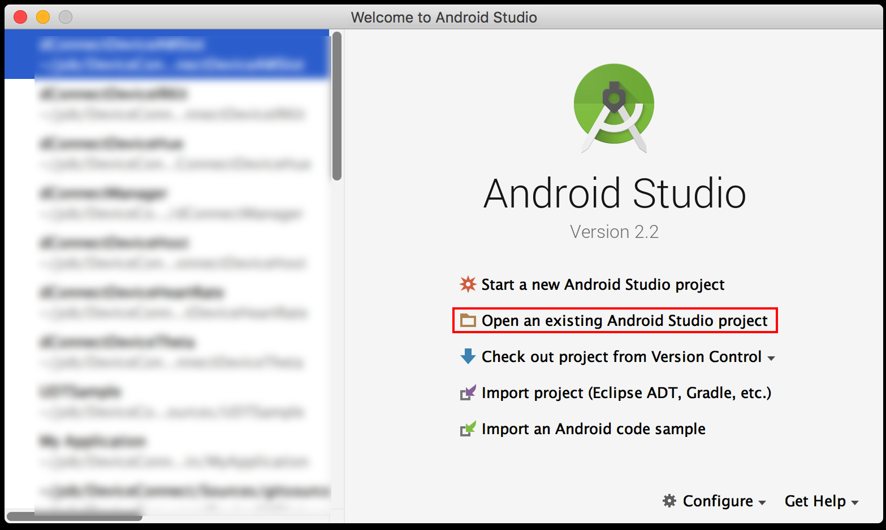
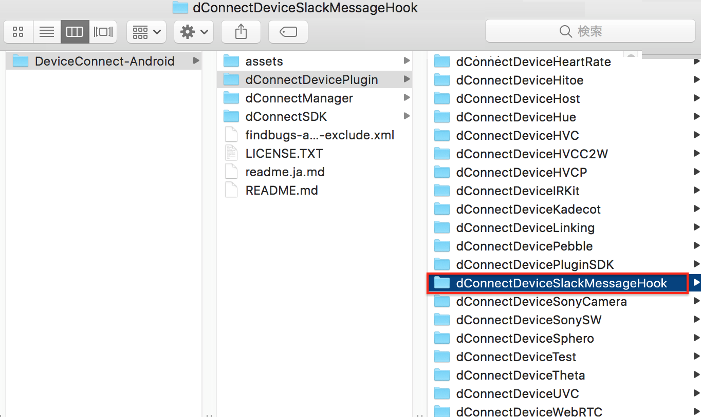
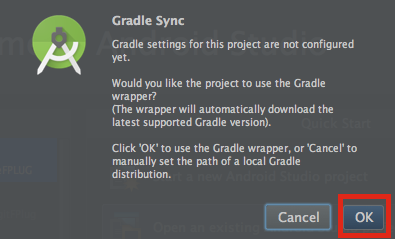
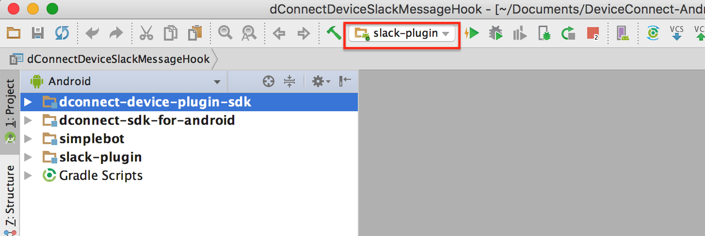
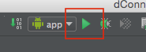
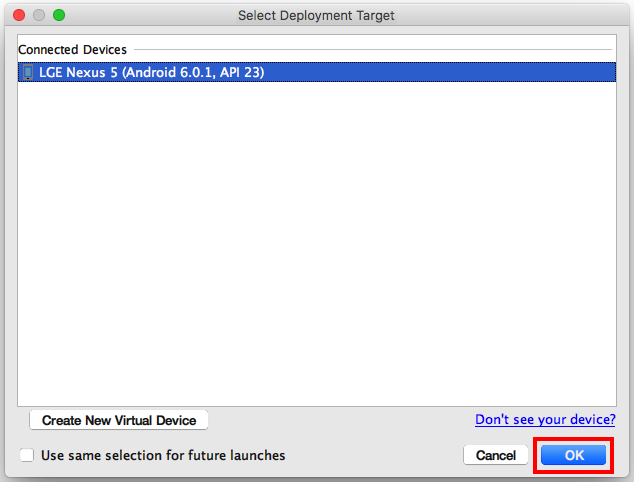

# SlackMessageHookプラグイン

このSlackMessageHookプラグインでは、Slack上のメッセージの取得、送信などの操作する機能を提供します。

このプラグインを使用するためには、Slackにログインする必要があります。

## 目次
* [開発環境](#section1)
* [サポートするプロファイル](#section2)
* [ビルド手順](#section3)
 * [Android Slack Bot デバイスプラグインのBuildに必要なパッケージ](#section3.1) 
   * [Device Connect SDK](#section3.1.1)
 * [プロジェクトのビルド手順](#section3.2)
   * [Android Studio](#section3.2.1)
     * [dConnectDeviceSlackMessageHookのImport](#section3.2.1.1)
     * [dConnectDeviceSlackMessageHookのBuild](#section3.2.1.2)

## <a name="section1">開発環境</a>
Android Studio 2.2.1以上

## <a name="section2">サポートするプロファイル</a>

* messageHook

## <a name="section3">ビルド手順</a>
#### ※注意1： 本Projectの文字コードはUTF-8を使用しています。ビルドエラーが表示される場合は、AndroidStudioの文字コードをUTF-8に設定してください。 
 

#### ※注意2： Windowsでは展開するディレクトリ位置によっては「パスが長すぎる」とエラーになりますので、その場合はDeviceConnect-Androidをルートフォルダに展開してください。 
※本エラーは、バージョンに関わらず、すべてのWindowsで発生する可能性がありますので、ご注意ください。
詳しくは<a href="http://windows.microsoft.com/ja-jp/windows/file-names-extensions-faq#1TC=windows-7" target="_blank">こちら</a>をご覧ください。

## <a name="section3.1">Android Slack BotデバイスプラグインのBuildに必要なパッケージ</a> 
SlackBotバイスプラグインのBuildに必要なパッケージは以下の通りになります。

### <a name="section3.1.1">Device Connect SDK</a> 

|項目|説明|
|:--|:--|
|dConnectDevicePluginSDK|デバイスプラグイン用のSDK。dConnectSDKAndroidをライブラリとして参照。|
|dConnectSDKAndroid|Androidに関連する部分のSDK。|

## <a name="section3.2">プロジェクトのBuild手順</a> 
{レポジトリフォルダ}は、githubからプロジェクトをチェックアウトしたフォルダを指します。 
また、本書ではAndroidフォルダにプロジェクトをチェックアウトしたことを前提で説明を行います。 

### <a name="section3.2.1">Android Studio</a>
#### <a name="section3.2.1.1">dConnectDeviceSlackMessageHookのImport</a>

まずAndroid Studioを起動してください。 
Quick Startの[Open an existing Android Studio project]を選択してください。 

dConnectDeviceSlackMessageHookを選択してください。 
dConnectDeviceSlackMessageHookは 
{レポジトリフォルダ}/dConnectDevicePlugin/dConnectDeviceSlackMessageHookにあります。 
 

 dConnectDeviceSlackMessageHookを選択すると、このようなウィンドウが表示されます。 
 赤く囲まれたところを押してください。 

 

#### <a name="section3.2.1.3">ConnectDeviceSlackMessageHookのBuild</a>

slack-pluginを選択します。

赤く囲まれているRunボタンを押してください。 

その後、このような画面が出てくるので、インストールしたい端末を選んでOKをクリックしてください。 

#### ※注意：setting.gradleファイルはレポジトリ上の構成でビルドできるように設定されているため、ディレクトリ構造を変えてビルドするときはsetting.gradleファイルを適宜書き換えてください。 
